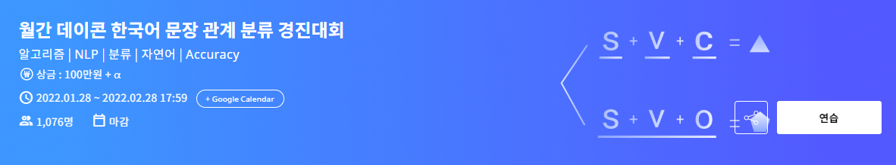
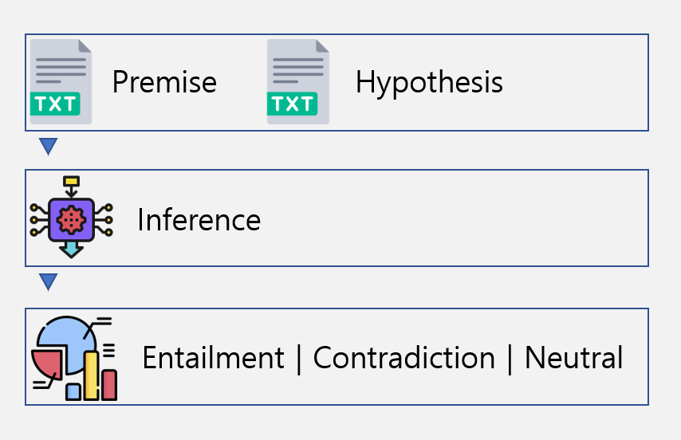

# 한국어 문장 관계 분류 경진대회 

대회 링크 : https://dacon.io/competitions/official/235875/overview/description

---
## 대회 개요
* 본 경진대회는 Natural Language Inference Dataset을 활용합니다.

출처: https://klue-benchmark.com/tasks/68/overview/description

* 한 쌍의 문장은 Premise와 Hypothesis로 구성되어 있습니다. premise 문장을 참고해 hypothesis 문장이 참인지(Entailment), 거짓인지(Contradiction), 혹은 참/거짓 여부를 알 수 없는 문장인지(Neutral)를 판별 합니다.

---
## 학습
* Model
  * klue/robert-large
* Optimizer
  * AdamW
* Loss
  * cross_entropy
* Learning rate scheduler
  * Cosine annealing with warmup
    
